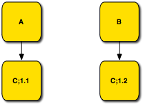

## Background

The problem that versioning addresses is the independent evolution of dependent _artifacts_. In OSGi terms, a bundle can import a package exported by another bundle. The importer therefore has a dependency on the exporter.  An _importer_ will use a specific _exporter_ during the compilation and build process. Ideally, this same exporter is used during the deployment process to create _fidelity_ between the build and run time. This fidelity reduces the number of potential problems because many aspects are guaranteed to be verified during the build process.

However, in reality, the importer and exporter evolve independently. Creating a requirement for strict fidelity between importers and exporters requires a coordination between build and deploy time that is often not feasible in practice. Pure fidelity would require a complete rebuild of all artifacts when one artifact changes even slightly. This might be feasible when all software as sourced in-house and built together, but in today’s world the projects that do not depend on open source projects or external suppliers are extremely rare. The key problem is that in a large system there will be many shared dependencies. For example, in a system with three bundles, A, B, and C, both A and B could depend upon C. See the following figure. With strict fidelity, A and B must be compiled against the same C to be able to deploy them together. In large systems with hundreds of bundles, requiring all components to be compiled against the identical dependency providers quickly becomes infeasible.



**Figure 1: Semantic Versioning and shared dependencies in a large system.**

_Backward compatibility_ is the lubrication that reduces the friction to make it possible to run large systems based on disparate bundles that have shared dependencies. Backward compatibility decouples the importer and exporter by allowing a _range_ of exporters to satisfy the needs of an importer. This allows an exporter to evolve without requiring the importer to change, or even to be rebuild, as long as the exporter’s version remains in range.

Java has well defined binary compatibility rules. The dynamic linking of Java code permits quite a lot of changes between compilation time and runtime. Classes can get new fields and methods, the hierarchy can change, order of fields and methods can change, and more. However, interfaces in Java have very different rules for binary compatibility between _users_ of an interface and _implementers_ of an interface. From the perspective of a user, an interface can be changed significantly. In contrast, almost any change will not be backward compatible for an implementer of that interface. For example, adding a new method to an interface is invisible to an importer that uses that interface; such a change is, therefore, binary compatible for this user. However, an importer that implements that interface will be broken by such an addition. The distinction between the different roles to decide backward compatibility is a crucial one that has implications for the importers. Users and implementers must specify different version ranges for the exporters with which they can be compatible. An importer that implements interfaces from a package will require a much narrower range than an importer that only uses such interfaces.

For example, a bundle A exports an API package containing the following interface:

```
Bundle A:
  package com.acme.foo;
  public interface Foo {
  void bar();
  }
```

An implementation bundle B implements this interface:

```
Bundle B:
  package com.acme.impl.foo;
  import com.acme.foo.*;
  public class FooImpl implements Foo {
  public void bar() {}
  }
```

And the client bundle C uses the interface:

```
Bundle C:
  package com.acme.user.foo;
  import com.acme.foo.*;
  public class Client {
    public void foo(Foo foo) {
    foo.bar();
    }
  }
```

In the next release, the Foo interface exported by bundle A is updated to:

```
Bundle A:
  package com.acme.foo;
  public interface Foo {
  void bar();
  void baz();
  }
```

This change is _not_ backward compatible for bundle B but is backward compatible for bundle C.

There are different types of importers that have different rules around backward compatibility. What is backward compatible for one importer is backward incompatible for another. This difference is introduced by the separation of API and implementation. An API package has two users: the _consumers_ that use the API and the _providers_ that implement the API.

Though the Java interface crisply demonstrates the issue with different backward compatibility rules for users and implementers, the model turns out to be simplistic in practice. In OSGi, the dominant artifact to be shared is a _package_. A package should consist of a cohesive set of classes, interfaces, and resources. Broadly speaking, there are two types of packages: libraries and API. A library unifies the API and the provider of this API. For example, a library like ASM[^1] does not attempt to separate the concrete implementation classes from their API, the API is the implementation.

API packages specify an abstract API to be implemented by an unmentioned provider. API packages are the core of the OSGi service model, whereby the provider of an API is represented by a service object. For example, the `org.osgi.service.eventadmin` package contains the API for an Event Admin provider. A consumer of Event Admin imports this package and a provider of Event Admin imports this package as well. Similar to interfaces, API packages have two types of importers; to distinguish between these roles they are called _consumers_ and _providers_.


**Figure 2: Consumers and Providers, the two OSGi API Package importers.**

Consumers are not always only users of the interfaces in the API packages, nor are providers always only implementers of such interfaces. A consumer of an API package can actually be required to implement an interface that is then used by the provider of the API package. For example, in the Event Admin specification the Event Listener interface is implemented by the consumer of the Event Admin API and then used by the provider of the Event Admin API.


**Figure 3: The inter-relationships of OSGi API Package consumers and providers.**

To prevent confusion, this document always makes it explicit if an interface or package is discussed. A _consumer_ consumes an API package, a _provider_ provides an implementation of an API package. An _implementer_ implements an interface and a user uses an interface. Last but not least, an _importer_ imports a package and an _exporter_ exports a package. Though this constellation might be confusing, all combinations of these concepts in real systems are quite common, these are all orthogonal concepts.

It should be obvious that binary compatibility plays an important role in backward compatibility. However, backward compatibility is also very dependent on the semantics. If the responsibility of an interface changes it could still be binary compatible but no longer be backward compatible.

---

[^1]: <https://asm.ow2.io/>
