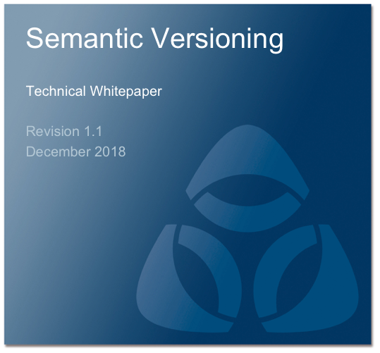

## Contents

[Executive Summary](010-executive-summary.html)

[Introduction](020-introduction.html)

[Background](030-background.html)

[Semantic Versions](040-semantic-versions.html)

[Exporter Policy](050-exporter-policy.html)

* [Importing the Packages You Export](050-exporter-policy.html#importing-the-packages-you-export)

[Importer Policy](060-importer-policy.html)

[Bundles and Fragments](070-bundles-and-fragments.html)

[Conclusion](080-conclusion.html)
