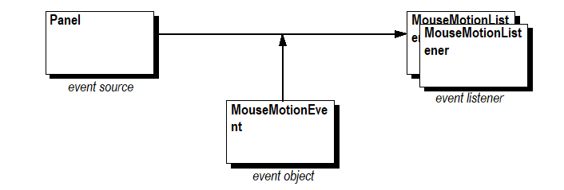
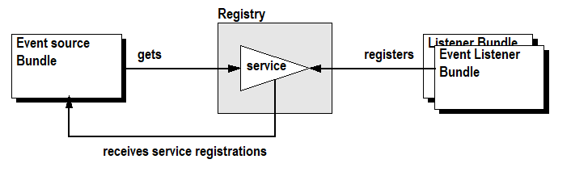

## Background

### The Listener Pattern

Java 1.0 contained a poorly designed model for handling events for user interface components in AWT. A major problem with this model is the event storms that can happen as well as overall inefficiency. When a new component model was created, the event model was redesigned to fit the new component model (beans). Cornerstones of this event model are the following parties:

1. The *event source* -- an object that can generate an event.

2. The *event object* -- an object that carries the information about the event.

3. The *event listener* -- an object that receives the event.

**Figure 1: Example actors in the event model of Java**

For example, to receive notification about the motion of a mouse, an object implementing the MouseMotionListener interface must be registered with an event source, such as an AWT Panel. The event source provides notification in the form of a MouseMotionEvent object sent to all listeners registered with the event source.

Some listener interfaces have many methods and are thus non-trivial to implement. To reduce the implementation effort required for a listener, default implementations of the listener interface are often provided and are called *adapters*.

One of the novel aspects of the listener pattern was the fact that event sources can support multiple listeners. Prior to the listener pattern, it was common to have APIs for which a single target object could be set with a callback. The listener pattern implicitly assumes that any number of listeners can be registered and that having a single listener is the exception. This was a huge improvement by making programmers aware that they are not in full control and that they must share the VM and application objects with others.

The listener pattern allows an introspective application to connect different components with events and listeners. It quickly became successful, and applications like the BeanBox use the listener pattern to dynamically create applications from a graphic UI.

However, the listener pattern has drawbacks. Presently, there are more than 130 event, adapter, and listener classes in Java. This creates an overhead in class files, affecting start-up time and program size, and also increases runtime overhead. In most cases, an event source has only a single listener registered. Still, the event source must take the overhead of correctly delivering an event to many listeners. This requires at least one extra List to hold the list of listeners and creates demand for "monster" classes like AWTEventMulticaster that try to maintain type safety of the pattern while still reaping the benefits of reusability. These problems are not important for desktop or server applications. When memory and CPU speed is abundant, a 100KB class file overhead for listener, adapter, and events classes is not a concern. In contrast, embedded environments, one of the targets of the OSGi specification, *are* sensitive to these overheads.

Another issue that is not obvious is the dependency that is created between the event source and the listener. Designs must correctly manage this dependency. If the event source goes away, the listener must clean up any references it holds. If the listener goes away, the event source should remove it from the list of listeners. These are the so-called life cycle issues. They usually are not a concern for traditional Java applications. The initialization phase of a traditional application, where listeners are added, is easy to implement correctly and even easier to verify (it just does not work if done wrong). However, the removal phase is much more difficult to verify and is often not handled at all. In workstation environments, where an application is started by the user, the life cycle management of listeners is a non-issue. Most applications assume that the cleanup is done when exiting or that no clean up is necessary. Again, no such assumptions can be made for embedded applications that run continuously and can be extremely dynamic. For example, [the tutorial concerning how to write a MouseMotionListener](https://docs.oracle.com/javase/tutorial/uiswing/events/mousemotionlistener.html) does not mention the fact that listeners should have a life cycle. [The Java tips article](https://www.infoworld.com/article/2077581/java-tip-79--interact-with-garbage-collector-to-avoid-memory-leaks.html) discusses these *loiterers* and offers some solutions.

### The OSGi Environment

The requirements for the OSGi environment include the following:

- Small devices

- Collaboration model

- Continuously up and running VM

- Life cycle management

These requirements come at a great cost.

Small devices are usually heavily constrained in persistent storage (often flash memory). Each class file has an overhead of at least 300 to 500 bytes, which adds up surprisingly fast. Use of these classes results in additional overhead. This implies that the number of classes should be kept low. Toward this end, during the early phases of the OSGi specification development, it was decided not to create ad-hoc exceptions or adapter classes.

Small devices are also constrained in performance and dynamic memory. Therefore, during the development of the OSGi specification, attempts were made to minimize the requirements for creating superfluous objects that used memory.

The OSGi collaboration model is implemented with the *service registry*. This registry allows *bundles* (applications) to register services. Services are normal Java objects that are typically defined by a Java interface allowing different implementations to co-exist. The dynamic nature of the registry makes it necessary to track services that can come and go at any time.

The continuously up and running nature of the OSGi environment combined with the life cycle management and service registry requires different programming rules. The requirements of the OSGi environment invalidate the following major hidden assumption in most Java code: *Once you have a reference to an object, the object does not go away*.

In an OSGi environment, the owner of an object can, and at some point, will go away. Services are dynamically added and removed from the registry. Java packages previously available may become unavailable. This highly dynamic environment dictates that original programming patterns must be revisited and reconsidered for this environment. A more reactive mindset is required.

A case where this is necessary is usage of the listener pattern in the OSGi environment. Here, an event listener must take action when a an event source is unregistered. Vice-versa, the event source must monitor the bundle of the event listener and take action when this bundle is stopped. It turned out that managing these dependencies is not trivial.

### The Whiteboard Pattern

The whiteboard pattern leverages the OSGi framework's service registry instead of implementing a private registry as required by the listener pattern. Instead of having event listeners track event sources and then register themselves with the event source, the whiteboard pattern has event listeners register themselves as a service with the OSGi framework. When the event source has an event object to deliver, the event source calls all event listeners currently registered in the service registry.

Remarkably, the event source is **not** registered with the framework as a service. This makes bundles using the whiteboard pattern significantly smaller and easier to implement. The inter-bundle dependency between the event source and the event listener is handled by the framework and requires almost no code in the event source and event listener bundles.

**Figure 1: Whiteboard actors in the OSGi framework**

Designs must often trade off between complexity in application bundles and server bundles. Servers by their nature are fewer in number and more system oriented. This usually means that it is better to place the complexity in the server and not in the client. However, the whiteboard is one of those rare cases where this tradeoff is not necessary. Both server and application become simpler because they reuse the framework registry. Both application bundles and server bundles can delegate the responsibility for managing the details of inter-bundle dependencies to the framework.

As an added benefit, the use of the OSGi framework's service registry provides more than just life cycle management. The service registry has additional benefits for the programmer:

- Debugging. The event listeners are visible in the registry and any framework support tool can inspect the registry. This makes inter-bundle dependencies more visible.

- Security. OSGi framework ServicePermissions can control access to an event source because event listeners must have permission to register the event listener interface.

- Properties. The registry supports properties that can be used by the server to select a subset of all listeners. This mechanism can be used for configuration management.
