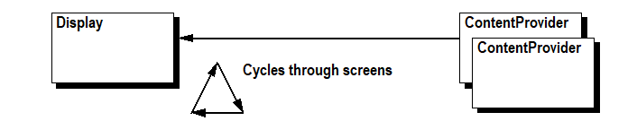
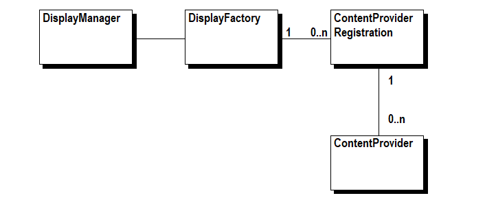

## An Example

### An LCD Display Bundle

The primary problem in OSGi environments is the handling of inter-bundle dependencies: one bundle referencing an object owned or created by another bundle. This problem can be explained using the following simple example.

The example consists of an LCD Display service that cycles through a number of screens. The content of the screens is provided by ContentProviders. This is a simple interface that can be implemented by any bundles that wants to be displayed on the LCD. ContentProviders are queried for their content when a new screen is needed. In this example, a Display is responsible for cycling through all the ContentProviders and a Clock implementing ContentProvider delivers the current time. System.out is used instead of a real display to keep the example as simple as possible.



**Figure 2: Actors in the example LCD Display application**

The focus of this example is to show how the dependency between the Display and the ContentProviders are handled. In the OSGi environment, the Display and the ContentProviders *both* can come and go at any moment.

This example will be implemented in the following sections by first using the listener pattern followed by the whiteboard pattern.

### Coding Rules

Code size comparisons between different approaches are subjective. It is easy to bloat one approach and minimize the other approach by combining classes and expressions. In the following approaches to the example, the same coding rules are followed. Different responsibilities (interfaces) are implemented in their own class. No expressions are combined and one statement is written per line.

### Listeners Implementation

The listener approach uses a ContentProvider (ClockManager) that tracks the Display object. The DisplayManager registers each ContentProvider and cycles through all the active ContentProviders.

The Display and ContentProvider interfaces must be implemented by any object wanting to act as a Display or a ContentProvider, respectively.

```java
package org.osgi.example.display;
public interface Display {
    void addContentProvider(ContentProvider p);
    void removeContentProvider(ContentProvider p);
}

package org.osgi.example.display;
public interface ContentProvider {
    String getContent();
}
```

**Figure 3: Interfaces with the listener pattern**

Next is the implementation of the ClockManager. The ClockManager tracks Display services in the registry with a DisplayTracker. The DisplayTracker extends the ServiceTracker. This utility class is designed to simplify monitoring services.

When a new Display service is registered with the OSGi framework, a Clock object is created and registered with the Display service as a ContentProvider. These objects are unregistered when the bundle is stopped or when the Display service is unregistered.[^1]

The ClockManager class implements the BundleActivator to keep the code simple.

```java
package org.osgi.example.listener.clock;
import org.osgi.example.display.*;
import org.osgi.framework.*;
import org.osgi.util.tracker.*;
import java.util.*;

class Clock implements ContentProvider {
    private final Display display;
    Clock(Display display) {
        this.display = display;
        display.addContentProvider(this);
    }
    void dispose() {
        display.removeContentProvider(this);
    }
    public String getContent() { return new Date().toString(); }
}

class DisplayTracker extends ServiceTracker<Display, Clock> {
    DisplayTracker(BundleContext context) {
        super(context, Display.class, null);
    }
    public Clock addingService(ServiceReference<Display> ref) {
        Display display = context.getService(ref);
        return new Clock(display);
    }
    public void removedService(ServiceReference<Display> ref, Clock clock) {
        clock.dispose();
        context.ungetService(ref);
    }
}

public class ClockManager implements BundleActivator {
    private DisplayTracker tracker;
    public void start(BundleContext context) {
        tracker = new DisplayTracker(context);
        tracker.open();
    }
    public void stop(BundleContext context) {
        tracker.close();
    }
}
```

**Figure 4: ClockManager source using the listener pattern**

Next is the implementation of the DisplayManager. The Display service *must* be implemented using a ServiceFactory. A ServiceFactory allows the DisplayManager to monitor the bundles registering ContentProvider services, and take action when such a bundle *gets* and *ungets* this Display service. It is provably impossible to write such a service correctly without using a ServiceFactory.

A single bundle can register more than one ContentProvider. For each bundle, a ContentProviderRegistration object is created that tracks the multiple ContentProvider registrations from that bundle. This allows the DisplayManager to properly remove all ContentProviders registered by a bundle when that bundle releases the Display service, for example, when the bundle is stopped.



**Figure 5: Multiple ContentProvider services per bundle**

To keep the code simple, the DisplayManager implements BundleActivator and Runnable. The run() method implements the core display cycle as an infinite loop, cycling through all the registered ContentProviders at 5 second intervals.

```java
package org.osgi.example.listener.display;
import org.osgi.framework.*;
import java.util.*;
import org.osgi.example.display.*;

class ContentProviderRegistration implements Display {
    private final List<ContentProvider> providers;
    private final DisplayManager manager;
    ContentProviderRegistration(DisplayManager manager) {
        this.manager = manager;
        providers = new ArrayList<>();
    }
    public synchronized void addContentProvider(ContentProvider p) {
        providers.add(p);
        manager.addContentProvider(p);
    }
    public synchronized void removeContentProvider(ContentProvider p) {
        if (providers.remove(p)) {
            manager.removeContentProvider(p);
        }
    }
    void synchronized dispose() {
        for (ContentProvider p : providers) {
            manager.removeContentProvider(p);
        }
        providers.clear();
    }
}

class DisplayFactory implements ServiceFactory<Display> {
    private final DisplayManager manager;
    DisplayFactory(DisplayManager manager) {
        this.manager = manager;
    }
    public Display getService(Bundle b, ServiceRegistration<Display> r) {
        return new ContentProviderRegistration(manager);
    }
    public void ungetService(Bundle b, ServiceRegistration<Display> r, Display s) {
        ContentProviderRegistration cpr = (ContentProviderRegistration) s;
        cpr.dispose();
    }
}

public class DisplayManager implements BundleActivator, Runnable {
    private volatile Thread thread;
    private ServiceRegistration<Display> registration;
    private final List<ContentProvider> providers = new ArrayList<>();
    public void start(BundleContext context) {
        DisplayFactory factory= new DisplayFactory(this);
        registration = context.registerService(
            Display.class,
            factory,
            null
        );
        thread = new Thread(this, "DisplayManager Listener");
        thread.start();
    }
    public void stop(BundleContext context) {
        thread = null;
    }
    public void run() {
        Thread current = Thread.currentThread();
        int n = 0;
        while (current == thread) {
            synchronized (providers) {
                if (!providers.isEmpty()) {
                    if (n >= providers.size())
                        n = 0;
                    ContentProvider cp = providers.get(n++);
                    System.out.println("LISTENER: " + cp.getContent());
                }
            }
            try { Thread.sleep(5000); } catch(InterruptedException e) {}
        }
    }
    void addContentProvider(ContentProvider p) {
        synchronized (providers) {
            providers.add(p);
        }
    }
    void removeContentProvider(ContentProvider p) {
        synchronized (providers) {
            providers.remove(p);
        }
    }
}
```

**Figure 6: DisplayManager source with the listener pattern**

### Whiteboard Implementation

Instead of tracking Display objects and then registering a ContentProvider with the Display, the whiteboard approach only registers a ContentProvider as a service with the OSGi framework. This ContentProvider is tracked by the DisplayManager. The DisplayManager is **not** registered with the framework. This makes the code significantly smaller and easier to implement.

Another advantage of the whiteboard approach is the requirement for only a single service interface: the ContentProvider.

```java
package org.osgi.example.display;
public interface ContentProvider {
    String getContent();
}
```

**Figure 7: Interface with the whiteboard pattern**

When using [Declarative Services](/specification/osgi.cmpn/7.0.0/service.component.html), no ClockManager implementation is necessary as Service Component Runtime (SCR), the runtime implementation of Declarative Services, handles all the details of managing the service of the Clock component. Registration and unregistration of the Clock's ContentProvider service is completely delegated to the SCR. The Component annotation causes SCR to register the component under the names of any directly implemented interfaces which is ContentProvider in this case.

```java
package org.osgi.example.component.clock;
import org.osgi.service.component.annotations.*;
import org.osgi.example.display.*;
import java.util.*;
@Component
public class Clock implements ContentProvider {
    public Clock() {}
    public String getContent() { return new Date().toString(); }
}
```

**Figure 8: Clock source with the whiteboard pattern**

The DisplayManager must track all the ContentProvider objects in the registry. Using Declarative Services, this can be handled automatically by SCR. As a result, the DisplayManager implementation becomes significantly smaller. The DisplayManager component does not register a service, so we specify service={} in the Component annotation since, by default, the component is registered as a service under the names of any directly implemented interfaces. The Reference annotation on the providers field tell SCR to track and inject all the ContentProvider services, since the field is a List of ContentProvider. Because the providers field is declared volatile, SCR will update the field with a replacement List whenever the list of tracked ContentProvider services changes. This means it is always safe to quickly iterate over a reference to the list since list will not change once injected in the field.

As in the Listener example, the DisplayManager implements the display cycle in a thread that calls the run() method.

```java
package org.osgi.example.component.display;
import org.osgi.service.component.annotations.*;
import org.osgi.example.display.*;
@Component(service = {})
public class DisplayManager implements Runnable {
    private volatile Thread thread;
    @Reference
    private volatile List<ContentProvider> providers;
    @Activate
    void activate() {
        thread = new Thread(this, "DisplayManager Component");
        thread.start();
    }
    @Deactivate
    void deactivate() {
        thread = null;
    }
    public void run() {
        Thread current = Thread.currentThread();
        int n = 0;
        while (current == thread) {
            List<ContentProvider> providers = this.providers;
            if (!providers.isEmpty()) {
                if (n >= providers.size())
                    n = 0;
                ContentProvider cp = providers.get(n++);
                System.out.println("COMPONENT: " + cp.getContent());
            }
            try { Thread.sleep(5000); } catch(InterruptedException e) {}
        }
    }
}
```

**Figure 9: DisplayManager source with the whiteboard pattern**
